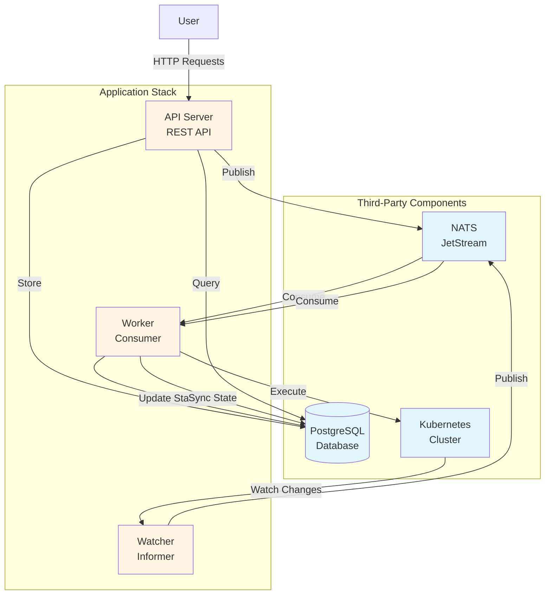

# K8s Deployment Manager

A Kubernetes deployment management system built with an event-driven architecture. This system provides a REST API for managing Kubernetes deployments asynchronously, with automatic synchronization between Kubernetes cluster state and the database.

## Overview

The K8s Deployment Manager enables users to create, update, and delete Kubernetes deployments through a simple REST API. The system handles all operations asynchronously via a message queue, ensuring scalability and resilience. A watcher component continuously syncs deployment state from Kubernetes to maintain consistency.

## High-Level Architecture



### Component Overview

**Third-Party Components:**
- **PostgreSQL**: Persistent storage for users, deployment requests, and deployments
- **NATS JetStream**: Message queue for asynchronous processing
- **Kubernetes Cluster**: Target cluster for deployment operations

**Application Components:**
- **API Server**: REST API for handling user requests
- **Worker**: Background worker that processes deployment requests and syncs state
- **Watcher**: Kubernetes informer that watches for deployment changes

## Features

### Core Features

- **Asynchronous Deployment Operations**: Create, update, and delete Kubernetes deployments via REST API
- **Request Tracking**: Track deployment requests with status (CREATED, SUCCESS, FAILURE)
- **Automatic State Synchronization**: Watcher automatically syncs Kubernetes deployment state to database
- **Idempotent Requests**: Unique `request_id` ensures safe retries without duplicates
- **User Management**: Automatic user creation on first request
- **Deployment Management**: List and query deployments with filtering by user

### API Features

- **RESTful API**: Clean REST endpoints for all operations
- **Request Idempotency**: Support for idempotent requests via `X-Request-ID` header
- **User Authentication**: Simple header-based authentication via `X-User-ID`
- **Swagger Documentation**: Auto-generated API documentation
- **Health Checks**: Health check endpoint for monitoring

### Architecture Features

- **Event-Driven**: Asynchronous processing via message queue
- **Scalable**: Components can be scaled independently
- **Resilient**: Failed requests can be retried via DLQ
- **Single Source of Truth**: Kubernetes is the authoritative source for deployment state
- **Fault Isolation**: Component failures don't propagate to other components

## Quick Start

### Prerequisites

- Kubernetes cluster
- `kubectl` configured
- Docker (for building images)

### Deploy

```bash
# Deploy third-party components
kubectl apply -f k8s/postgres/
kubectl apply -f k8s/nats/

# Deploy application components
make build-and-deploy
```

### Local Development

```bash
# Port forward services
kubectl port-forward svc/postgres 5432:5432 -n dep-manager
kubectl port-forward svc/nats 4222:4222 -n dep-manager

# Run components
make run          # API
make run-worker   # Worker
make run-watcher  # Watcher
```

For detailed setup instructions, see [Setup Documentation](./docs/setup.md).

## API Endpoints

### Deployment Requests

- `POST /api/v1/deployments/requests/create` - Create a deployment request
- `GET /api/v1/deployments/requests` - List deployment requests
- `GET /api/v1/deployments/requests/:id` - Get deployment request by ID
- `PATCH /api/v1/deployments/requests/:id` - Update deployment request
- `DELETE /api/v1/deployments/requests/:id` - Delete deployment request

### Deployments

- `GET /api/v1/deployments` - List deployments
- `GET /api/v1/deployments/:id` - Get deployment by identifier

### Health

- `GET /api/v1/ping` - Health check endpoint

### Documentation

- `GET /swagger/index.html` - Swagger API documentation

## Documentation

### Core Documentation

- **[Architecture](./docs/architecture.md)** - High-level design, data objects, and data flow
- **[Design Decisions](./docs/design-decisions.md)** - Architectural decisions and rationale
- **[Schema](./docs/schema.md)** - Database schema and design decisions
- **[Setup](./docs/setup.md)** - Deployment and development setup instructions
- **[AI Disclosure](./docs/ai-disclosure.md)** - Disclosure of AI tool usage in this project

### Additional Documentation

- **[Internal Package](./internal/README.md)** - Internal code organization
- **[Kubernetes Manifests](./k8s/README.md)** - Kubernetes deployment manifests
- **[Command Package](./cmd/README.md)** - Application entry points
- **[Package Library](./pkg/README.md)** - Shared packages and utilities

## Data Flow

### Create Deployment Request

1. User sends `POST /api/v1/deployments/requests/create`
2. API validates request and stores in database
3. Request is published to NATS queue
4. Worker consumes message and executes Kubernetes deployment
5. Result is stored back in deployment request

### Update/Delete Deployment

1. User sends `PATCH` or `DELETE` request
2. API updates deployment request in database
3. Message is published to NATS queue
4. Worker processes and updates Kubernetes
5. Status is updated in database

### State Synchronization

1. Watcher monitors Kubernetes deployments (filtered by manager tag)
2. On change, deployment name is published to NATS queue
3. Worker consumes message and fetches full deployment from Kubernetes
4. Deployment state is synced to database

## Key Concepts

### Deployment Request vs Deployment

- **Deployment Request**: User intent (CREATE, UPDATE, DELETE) - managed by API
- **Deployment**: Actual Kubernetes state - synced from Kubernetes cluster

### Single Source of Truth

- **Deployment**: Kubernetes cluster is the single source of truth
- **Deployment Request**: Database is the single source of truth

### Idempotency

- Unique `request_id` ensures safe retries
- Same `request_id` returns existing request instead of creating duplicate

### Identifier

- Unique `identifier` in deployment table prevents naming conflicts
- Used as deployment name in Kubernetes
- Allows retries even if synchronization fails

## Technology Stack

- **Language**: Go 1.26+
- **Framework**: Gin (HTTP framework)
- **Database**: PostgreSQL (via GORM)
- **Message Queue**: NATS JetStream
- **Kubernetes**: Kubernetes Client Go
- **Documentation**: Swagger/OpenAPI

## Project Structure

```
├── cmd/              # Application entry points
│   ├── api/          # API server
│   └── worker/       # Worker and watcher
├── internal/         # Private application code
│   ├── api/          # HTTP handlers and middleware
│   ├── repository/   # Data access layer
│   ├── service/      # Business logic
│   └── worker/       # Worker handlers
├── pkg/              # Shared packages
│   ├── config/       # Configuration management
│   ├── dto/          # Data transfer objects
│   ├── logger/       # Logging utilities
│   └── ports/        # Interfaces and ports
├── k8s/              # Kubernetes manifests
├── docker/            # Dockerfiles
└── docs/              # Documentation
```

## Contributing

This project follows a clean architecture pattern with clear separation of concerns:

- **Handlers** depend on service interfaces (from `pkg/ports/service`)
- **Services** depend on repository interfaces (from `pkg/ports/repo`)
- **Repositories** implement interfaces and interact with external systems
- All dependencies are injected via constructor functions

See [Internal Package Documentation](./internal/README.md) for more details.

## License

[Add your license here]
